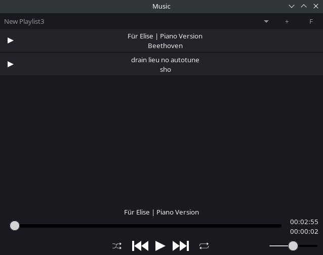

## Simple music app.

### Music app written in GTK4, libVLC used for audio, GUI was designed using Cambalache. This app has following features:
-- Shuffle, repeat, skip tracks

-- Create/remove playlists, add tracks to them, read tracks from folder

-- Sort tracks by descending

### Things2do:
-- Remove odd code

-- Add other types of sorting

-- Multi-select tracks for removal

-- Add support for themes

-- Auto-removing faulty tracks from playlist

-- Add support for notes/description to playlists

-- Make sliders look nicer

### Playlists are created automatically and stored in "playlists" file in source directory.